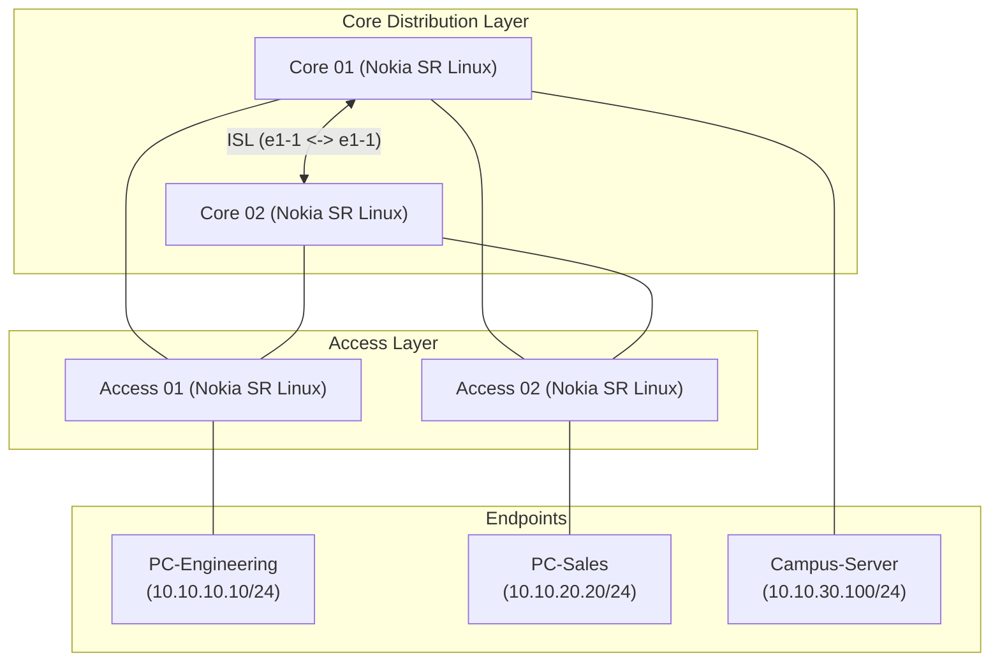

# Enterprise Campus Network Topology (`small-campus`)

## 1. Overview
A multi-tier campus network lab simulating core distribution switches, access layer switches, and endpoint workstations/servers using Nokia SR Linux and Alpine Linux containers.



---

## 2. Node & IP Addressing Plan

| Node Name | Device Type | Image | Management IP | Config File |
|---|---|---|---|---|
| **`core1`** | Nokia SR Linux | `ghcr.io/nokia/srlinux` | Dynamic (172.30.20.0/24) | `core1.cfg` |
| **`core2`** | Nokia SR Linux | `ghcr.io/nokia/srlinux` | Dynamic (172.30.20.0/24) | `core2.cfg` |
| **`access1`** | Nokia SR Linux | `ghcr.io/nokia/srlinux` | Dynamic (172.30.20.0/24) | `access1.cfg` |
| **`access2`** | Nokia SR Linux | `ghcr.io/nokia/srlinux` | Dynamic (172.30.20.0/24) | `access2.cfg` |
| **`campus-server`** | Linux (Alpine) | `alpine:latest` | `10.10.30.100/24` (Data) | Built-in exec |
| **`pc-eng`** | Linux (Alpine) | `alpine:latest` | `10.10.10.10/24` (Data) | Built-in exec |
| **`pc-sales`** | Linux (Alpine) | `alpine:latest` | `10.10.20.20/24` (Data) | Built-in exec |

---

## 3. Deployment & Lifecycle

```bash
# Deploy campus topology
sudo containerlab deploy -t campus.clab.yml

# Inspect running nodes
sudo containerlab inspect -t campus.clab.yml

# Destroy lab
sudo containerlab destroy -t campus.clab.yml --cleanup
```
