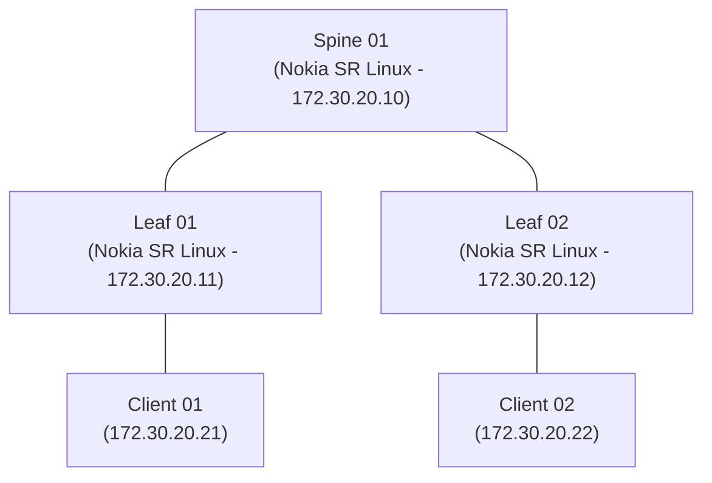

# 5-Node Leaf-Spine Clos Fabric with EVPN (`demo-clos`)

## 1. Overview
A data center Clos network topology deploying eBGP underlay and EVPN VXLAN overlay routing across Nokia SR Linux switches and Linux endpoints.



---

## 2. Fabric Architecture

* **Underlay Routing:** Point-to-point `/30` links between Spine and Leaves (`10.0.1.0/30`, `10.0.2.0/30`).
* **BGP Autonomous Systems:**
  * Spine 1: AS `65000`
  * Leaf 1: AS `65011`
  * Leaf 2: AS `65012`
* **Address Families:** `ipv4-unicast` + `evpn`.

---

## 3. Deployment & Automated EVPN Configuration

```bash
# 1. Deploy the Clos topology
sudo containerlab deploy -t topo.clab.yml

# 2. Automatically apply EVPN and BGP peering via Python script
python3 apply_evpn_config.py

# 3. Verify EVPN routes on Leaf 1
docker exec -it clab-demo-clos-leaf1 sr_cli "show network-instance default protocols bgp neighbor"

# 4. Teardown
sudo containerlab destroy -t topo.clab.yml --cleanup
```
